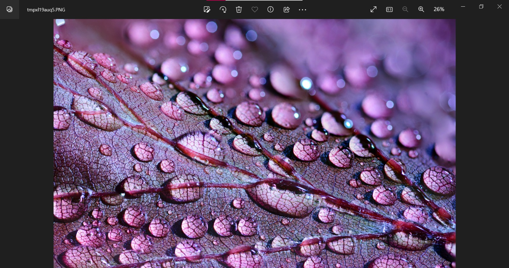

## ✔ IMAGE ENCRYPTION DECRYPTION
- An Image Encryption Decryption is an image processing application created in python with tkinter gui and OpenCv library.
- In this application user can select an image and can encrypt that image and can even decrpyt also.

****

### REQUIREMENTS :
- python 3
- os module
- cv2 module
- tkinter module
- filedialog from tkinter
- messagebox
- from PIL import Image, ImageTk
- from skimage import io
- matplotlib module
- numpy
- random
- time

****

### HOW TO Use it :
- User just need to download the file, and run the encrypt.py for encryption on local system.
- After running a GUI window appears, where user needs to choose an image file .
- After selecting the image, the image will be encrypted and a key will be generated.
- Now user can use the same key for decryption of the image by using decrypt.py file.
- The image thus gets decrypted.

### Purpose :
- This scripts helps us to easily encrypt any image for security purpose and can even decrypt also.

### Compilation Steps :
- Install tkinter, PIL, numpy, cv2, os, random
- After that download the code file, and run encrypt.py, followed by decrypt.py on local system.
- Then the script will start running and user can explore it by encrypting and decrypting any image and saving it.

****

### SCREENSHOTS :

   
   

****

### Name : 
- Gaurav Kulkarni
- Janhavi Komurlekar
- Arpita Saxena
- Nabodita Choudhury
